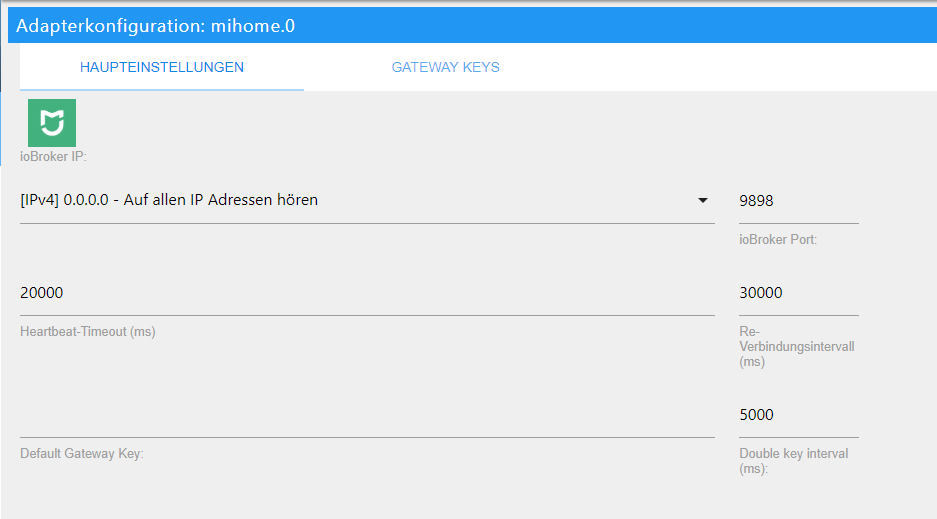

# ioBroker Mi Home Adapter
Mit dem Mi Home Adapter wird ein Mi Control Hub (Gateway) in ein ioBroker System  
eingebunden und ermöglicht so die Kommunikation verschiedener Xiaomi Sensoren,  
Schalter etc. mit ioBroker.

Die Beleuchtung und der Lautsprecher des Gateways können über ioBroker gesteuert  
werden.

## Voraussetzungen
* Mi Home App auf Android oder iOS Gerät und frei geschaltete lokale Netzwerk Funktion
* Angeschlossenes Mi Home Gateway
* Betriebsbereites ioBroker System

### Installation der Mi Home App

#### Android
* [Android Mi Home App][Android App] auf einem Android Gerät herunterladen, installieren, öffnen und  
den Geschäftsbedingungen zustimmen.
* Als Land `Festland-China` auswählen 
* Über `Anmelden` ein Konto erstellen
* Nach der erfolgreichen Anmeldung über `+` ein Gerät hinzufügen
* Unter `Haushaltssicherheit` den `MI Control Hub` auswählen und den Anweisungen   
folgen
* Nach erfolgreichem einbinden des Gateways die 3 Punkte am oberen rechten Bildschirm   
und danach `About` betätigen
* Den Text `Plug-in version` unten 10mal tippen
* Nun ist der Entwickler Modus eingeschaltet und es sollten nach einer gewissen Zeit   
2 weitere Menüpunkte erscheinen   
>Falls nicht, wiederholt versuchen
* Den Menüpunkt `Wireless communication protocol` auswählen
* Den Schiebeschalter oben einschalten, das Passwort notieren und mit `OK` bestätigen.  
>Das Passwort wird später bei der ioBroker Installation benötigt.

Nun können weitere Geräte über das `+` Zeichen angelernt werden.

#### iOS
* [iOS Mi Home App][ios App] auf einem iOS Gerät herunterladen, installieren, öffnen und der  
Datenschutzerklärung zustimmen
* Über Profil/Einstellungen/Ländereinstellungen das Land `Festland` auswählen. 
* Über `Anmelden` ein Konto erstellen
* Nach der erfolgreichen Anmeldung über `+` ein Gerät hinzufügen
* Unter `Haushalt Sicherheit` den `MI Control Hub` auswählen und den Anweisungen   
folgen
* Nach erfolgreichem einbinden des Gateways die 3 Punkte am oberen rechten Bildschirm   
betätigen und `About` betätigen
* Wiederholt im leeren unteren Bereich tippen 
* Nun ist der Entwickler Modus eingeschaltet und es sollten nach einer gewissen Zeit   
weitere Menüpunkte erscheinen   
> Falls es nicht gleich klappt, die Schritte wiederholen
* Den 4. Menüpunkt auswählen
* Den Schiebeschalter oben einschalten, das Passwort notieren und mit `OK` bestätigen.  
>Das Passwort wird später bei der ioBroker Installation benötigt.

Nun können weitere Geräte über das `+` Zeichen angelernt werden.

### Einstellung am Router
Unter About/Hub info kann im Text nach _localip_ die vom Gateway verwendete IP Adresse   
des Gateways ermittelt werden. Im verwendeten Router sollte diese IP dem Gateway fest   
zugewiesen werden.  
Falls die Bedienung der angelernten Geräte über die App nicht mehr gewollt ist, kann nach   
dem anlernen aller Geräte im Router auch der Internet Zugriff des Gateways abgeschaltet   
werden.

### Unterstützte Geräte
Die folgende Aufstellung erhebt keinen Anspruch auf Vollständigkeit:
- gateway -           Xiaomi RGB Gateway
- sensor_ht -         Xiaomi Temperature/Humidity
- weather.v1 -        Xiaomi Temperature/Humidity/Pressure
- switch -            Xiaomi Wireless Switch
- sensor_switch.aq2 - Xiaomi Aqara Wireless Switch Sensor
- sensor_switch.aq3 - Xiaomi Aqara Wireless Switch Sensor
- plug -              Xiaomi Smart Plug
- 86plug -            Xiaomi Smart Wall Plug
- 86sw2 -             Xiaomi Wireless Dual Wall Switch
- 86sw1 -             Xiaomi Wireless Single Wall Switch
- natgas -            Xiaomi Mijia Honeywell Gas Alarm Detector
- smoke -             Xiaomi Mijia Honeywell Fire Alarm Detector
- ctrl_ln1 -          Xiaomi Aqara 86 Fire Wall Switch One Button
- ctrl_ln1.aq1 -      Xiaomi Aqara Wall Switch LN
- ctrl_ln2 -          Xiaomi 86 zero fire wall switch double key
- ctrl_ln2.aq1 -      Xiaomi Aqara Wall Switch LN double key
- ctrl_neutral2 -     Xiaomi Wired Dual Wall Switch
- ctrl_neutral1 -     Xiaomi Wired Single Wall Switch
- cube -              Xiaomi Cube
- sensor_cube.aqgl01 - Xiaomi Cube
- magnet -            Xiaomi Door Sensor
- sensor_magnet.aq2 - Xiaomi Aqara Door Sensor
- curtain -           Xiaomi Aqara Smart Curtain
- motion -            Xiaomi Motion Sensor
- sensor_motion.aq2 - Xiaomi Aqara Motion Sensor
- sensor_wleak.aq1 -  Xiaomi Aqara water sensor
- ctrl_ln2.aq1 -      Xiaomi Aqara Wall Switch LN (Double)
- remote.b286acn01 -  Xiaomi Aqara Wireless Remote Switch (Double Rocker)
- remote.b1acn01 -    Xiaomi Aqara Wireless Remote Switch
- vibration -         Xiaomi vibration Sensor
- wleak1 -            Xiaomi Aqara Water Sensor
- lock_aq1 -          Xiaomi Lock

## ioBroker Mi Home Adapter Installation
Weitere Einstellungen erfolgen nur noch über die ioBroker Admin-Oberfläche.  
Den Adapter im Bereich `Adapter` suchen und über das `+` Zeichen installieren. 

Es öffnet sich dann folgendes Konfigurationsfenster:

Unter `Default Gateway Key` das oben ermittelte Passwort eintragen und mit `speichern`  
`und schließen` das Fenster schließen. Der laufende Adapter sollte danach unter   
`Instanzen` grün angezeigt werden:

Unter `Objekte` wird nun das Gateway und seine angelernten Geräte angezeigt:

## Links

[Android App]:(https://play.google.com/store/apps/details?id=com.xiaomi.smarthome)

[iOS App]:(https://itunes.apple.com/de/app/mi-home-xiaomi-smarthome/id957323480?mt=8)
